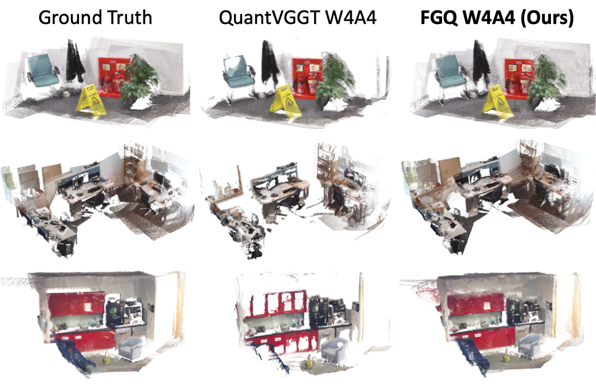

<h1 align="center">Not All Tasks Quantize Equally: Fisher-Guided Quantization for Visual Geometry Transformer</h1>

<p align="center">
  <a href="https://arxiv.org/abs/2605.15828">
    
  </a>
  <a href="https://github.com/yipu123/FGQ">
    
  </a>
</p>

<div align="center">
Yipu Zhang<sup>1,*</sup>, Jintao Cheng<sup>1,*</sup>, Weilun Feng<sup>2,3,*</sup>, Jiehao Luo<sup>4</sup><br>
Chuanguang Yang<sup>2</sup>, Zhulin An<sup>2</sup>, Yongjun Xu<sup>2,5</sup>, Wei Zhang<sup>1,†</sup>
</div>

<p align="center">
<sup>1</sup>Department of Electronic and Computer Engineering, HKUST<br>
<sup>2</sup>State Key Laboratory of AI Safety, Institute of Computing Technology, Chinese Academy of Sciences<br>
<sup>3</sup>University of Chinese Academy of Sciences<br>
<sup>4</sup>School of Data Science and Engineering, South China Normal University<br>
<sup>5</sup>Xiamen Institute of Data Intelligence
</p>

<p align="center">
<sup>*</sup>Equal contribution. <sup>†</sup>Corresponding author.
</p>

## 📰 News

- **[2026.05.22]** 🎉 Paper and code are released. Check out our paper at [arXiv:2605.15828](https://arxiv.org/abs/2605.15828).

## Visualization

<p align="center">
  
</p>

## 🔍 Overview

Feed-forward 3D reconstruction models, represented by Visual Geometry Grounded Transformer (VGGT), jointly predict multiple visual geometry tasks such as depth estimation, camera pose prediction, and point cloud reconstruction in a single forward pass. They have been widely adopted in 3D vision applications, but their billion-scale parameters bring substantial memory and computation overhead, posing challenges for on-device deployment. Post-Training Quantization (PTQ) is an effective technique to reduce this overhead. Existing PTQ methods for feed-forward 3D models mainly focus on handling heavy-tailed activation distributions and constructing diverse calibration datasets. However, we observe that feed-forward 3D models predict multiple geometric attributes through a shared backbone, where different transformer blocks and hidden channels contribute distinctly to each task, resulting in substantially different sensitivities to quantization errors across tasks, blocks, and channels. Consequently, treating all tasks equally over-emphasizes insensitive tasks and causes significant accuracy loss on the sensitive ones. To address this issue, we propose Fisher-Guided Quantization (FGQ) for feed-forward 3D reconstruction models. Specifically, FGQ uses the diagonal Fisher information matrix to quantify the different sensitivities across tasks, blocks, and channels, and incorporates these sensitivities into the Learnable Affine Transformation during calibration to better preserve the channels and blocks most critical to each task. Extensive experiments across camera pose estimation, point map reconstruction, and depth estimation show that FGQ consistently outperforms state-of-the-art quantization baselines on VGGT, achieving up to 39% relative improvement under the 4-bit quantization.


## 🔨 Installation

The environment used for this release is:

- Python 3.10
- PyTorch 2.6.0
- Torchvision 0.21.0
- CUDA 12.4
- Transformers 4.45.0
- Accelerate 0.32.0

```bash
conda create -n fgq python=3.10 -y
conda activate fgq
pip install -r requirements.txt
```

FGQ uses FlatQuant modules as an external dependency for fake quantization. Clone FlatQuant separately and add it to `PYTHONPATH`:

```bash
git clone https://github.com/ruikangliu/FlatQuant.git /path/to/FlatQuant
export PYTHONPATH="/path/to/FlatQuant:$PYTHONPATH"
```

Download the VGGT checkpoint from the official VGGT release or Hugging Face, then update `pretrained_model_name_or_path` in `configs/model/default.yaml`, or override it from the command line.

## FGQ Workflow

### 1. Compute VGGT Fisher

```bash
python scripts/compute_fisher.py \
  --model_path /path/to/VGGT-1B \
  --cali_dataset co3d \
  --cali_data_dir data/co3dv2/data \
  --nsamples 32 \
  --num_frames 4 \
  --img_size 518 \
  --save_dir outputs/fisher
```

The main output is `outputs/fisher/fisher.pt`, with shape `[3, 48, 1024]` for camera, depth, and point-map task sensitivity.

### 2. Calibrate VGGT With FGQ

```bash
python scripts/calibrate_flatquant_vggt.py \
  --model_path /path/to/VGGT-1B \
  --save_dir checkpoints \
  --w_bits 4 \
  --a_bits 4 \
  --cali_dataset co3d \
  --cali_data_dir data/co3dv2/data \
  --nsamples 64 \
  --num_frames 4 \
  --epochs 15 \
  --flat_lr 5e-3 \
  --cali_trans \
  --add_diag \
  --lwc \
  --lac \
  --warmup \
  --use_fisher \
  --fisher_path outputs/fisher/fisher.pt
```

The default output filename is `model_flatquant_w4a4_fisher.pt`. Use `--output_name` to choose a different filename.

### 3. Evaluate FGQ

Relative pose on CO3Dv2:

```bash
python relpose/eval_angle.py \
  evaluation=relpose-angular \
  eval_models=[vggt_flatquant_fisher] \
  eval_datasets=[CO3Dv2] \
  model.vggt_flatquant_fisher.cfg.pretrained_model_name_or_path=/path/to/VGGT-1B \
  model.vggt_flatquant_fisher.cfg.quantized_model_path=checkpoints/model_flatquant_w4a4_fisher.pt
```

Relative pose distance on RealEstate10K:

```bash
python relpose/eval_dist.py \
  evaluation=relpose-distance \
  eval_models=[vggt_flatquant_fisher] \
  eval_datasets=[Re10K] \
  model.vggt_flatquant_fisher.cfg.pretrained_model_name_or_path=/path/to/VGGT-1B \
  model.vggt_flatquant_fisher.cfg.quantized_model_path=checkpoints/model_flatquant_w4a4_fisher.pt
```

Multi-view reconstruction:

```bash
python mv_recon/eval.py \
  evaluation=mv_recon \
  eval_models=[vggt_flatquant_fisher] \
  eval_datasets=[7scenes-sparse,DTU,ETH3D] \
  model.vggt_flatquant_fisher.cfg.pretrained_model_name_or_path=/path/to/VGGT-1B \
  model.vggt_flatquant_fisher.cfg.quantized_model_path=checkpoints/model_flatquant_w4a4_fisher.pt
```

Useful model keys in `configs/model/default.yaml`:

| Model Key | Meaning |
| --- | --- |
| `vggt` | Full-precision VGGT baseline |
| `vggt_flatquant` / `vggt_flatquant_w4a4` | W4A4 fake-quant VGGT checkpoint |
| `vggt_flatquant_fisher` | FGQ W4A4 fake-quant VGGT checkpoint |


## Citation

```bibtex
@article{zhang2026not,
  title={Not All Tasks Quantize Equally: Fisher-Guided Quantization for Visual Geometry Transformer},
  author={Zhang, Yipu and Cheng, Jintao and Feng, Weilun and Luo, Jiehao and Yang, Chuanguang and An, Zhulin and Xu, Yongjun and Zhang, Wei},
  journal={arXiv preprint arXiv:2605.15828},
  year={2026}
}
```

## Acknowledgements

This code builds on VGGT and [FlatQuant](https://github.com/ruikangliu/FlatQuant), and uses evaluation code from [recons_eval](https://github.com/ZhouTimeMachine/recons_eval). Please also follow their licenses and citation requirements when using this repository.

## Contact

For questions, please contact Yipu Zhang &lt;yzhangqg@connect.ust.hk&gt;. Corresponding author: Wei Zhang &lt;wei.zhang@ust.hk&gt;.
